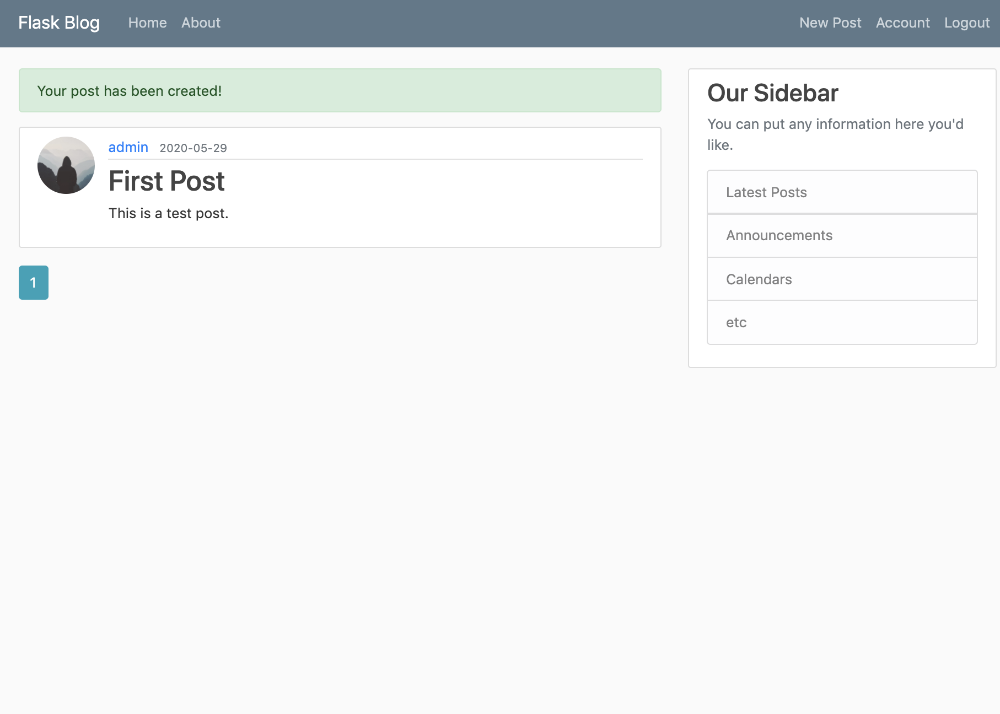

# Flask Blog Website

A personal blog created in Flask, same as the one created in Django.

## Table of Contents

- [Flask Blog Website](#flask-blog-website)
  - [How to run](#how-to-run)
  - [Application Display](#application-display)
- [Notes on Flask App](#notes-on-flask-app)
  - [1 - Setup](#1---setup)
  - [2 - Templates](#2---templates)
  - [3 - Forms and User Input Validation](#3---forms-and-user-input-validation)
  - [4 - FlaskSQLAlchemy Database](#4---flasksqlalchemy-database)
  - [5 - Restructure a Flask application from modules to packages](#5---restructure-a-flask-application-from-modules-to-packages)
  - [6 - Create users through registration form](#6---create-users-through-registration-form)
  - [7 - User Account Information](#7---user-account-information)
  - [8 - CRUD posts to home page (create, read, update, delete)](#8---crud-posts-to-home-page-create-read-update-delete)
  - [9 - Pagination](#9---pagination)
  - [10 - Password Reset](#10---password-reset)
  - [12 - Restructuring and Modularizing the Application Using Blueprint](#12---restructuring-and-modularizing-the-application-using-blueprint)

## How to run

Activate `venv`

Then run: `python3 run.py`

Now, it is running on `http://127.0.0.1:5000/`

## Application Display



# Notes on Flask App

## 1 - Setup

```
`app = Flask(__name__)`
```

We create app variable and set it as an instance of the Flask class. `__name__` is a special variable in Python for name of the module. This is so Flask knows where to look for templates and files in the. project. The app variable instantiates the Flask application.

```
`@app.route("/")`
```

Route decorators are routes we type into browser to go into different pages. Decorators are ways to add additional functionalities to a function. Route decorators handle all the backend processing and return the information we need for that specified route.

```
export FLASK_APP=run.py
flask run
```

On the command line, do this on the command line to specify the Flask app and run it.

```
python3 run.py
```

This does the same thing as `flask run`. We just dont have access to the Flask terminal if we do it from Python so we don't need to export the env variables again every time we close the terminal.

```
http://127.0.0.1:5000/
```

Running the web server is a feature upon Flask itself. 127.0.0.1 is the address for localhost. 5000 is the port number.

```
if __name__ == '__main__':
    app.run(debug=True)
```

Debug - we can run the application directly in Python in debug. This is so we dont have to kill web server and reload page (flask run) every time we update page. Just refresh the browser and changes will automatically populate.

## 2 - Templates

We use templates to return HTML code and pass variables through web page. We create a templates directory to keep all our HTML files, and create templates HTML files for all of our routes (i.e. `home.html`, `about.html`).

```
import render template fxn: from flask import Flask, render_template

def home():
    return render_template('home.html', posts=posts)
```

We return the template in app. We pass in posts variable into the web page, and posts is a list of dictionaries where each dictionary represents a blog post

```
# ex. for loop:
 {{ post.title }} 
 {{ else }} 
```

This is how we loop through posts data. The templating engine used for Flask is Jinja 2, which allows us to write code in the templates. Code is written in the code block ``, described below.

### Template Inheritance

We don't want repeated code, so we can move all of the repeated code for a layout into `layout.html`.

```
 {% endblock *}
```

A block is a section that the child templates can override. We create this on the body tag to override the content section.

In the child template, do

```

 content of block here 
```

Here, `content` is the name of our block. The information in the code block named `content` in the child templates will be displayed along with the layout template.

In the `layout` file, the information from the child templates gets placed in the block for `content`.

Static files like css and js are located in the static folder (i.e. `main.css`).

## 3 - Forms and User Input Validation

With forms, we can create accounts log in, make posts, and log out. If we were to make forms from scratch, we need to put in different kinds of validation checks to make sure the user is added to database already, the passwords match, regular expressions to fit criteria to make sure an email is valid.

But instead, we can use flask-wtf (WTForms):

```
from flask_wtf import FlaskForm
```

### Forms

This is different from regular HTML forms. Instead, Python classes are representative of our forms and then are automatically converted into an HTML form in our template. The forms are managed in `forms.py`. Examples are `RegistrationForm` and `LoginForm`.

### Fields

In a form, we have different form fields that are imported from classes like `WTForms`. I.e. the `username` and `email` fields are of `StringField`, `password` is of `PasswordField`, and the class is imported from `WTForms`.

#### Validators

We use validators to put checks in place for forms. Validators are put in as arguments in a form. Validators are also classes we import (i.e. `DataRequired` comes from `wtforms.validators`). Examples of validators are `DataRequired()` to make sure there is input data, , `Length(min=2, max=20)` to set a length limit, and `Email()` to make sure an email is valid.

### Security

We set a secret key as an environment variable to protect against modifying cookies, forgery attacks in the env folder.

### Routing

```
i.e. @app.route("/register", methods=['GET', 'POST'])
def register():
```

We can add routes to our forms in `routes.py` ex. for `RegistrationForm`. In methods, we can add a list of allowed methods to the route (GET, POST). To make the resulting HTML form page, pass the form into the `render_template` and return the result.

#### Form Validation

If form is validated when submitted via `form.validate_on_submit()`, the username and hashed password gets added to the database. We can do a flash message to send an alert.

### HTML Form Page

#### register.html and login.html

On the HTML page, we put our form into the content section of the pages. The form on the HTML page looks like this:

```
<form method="POST" action="">
```

- On the form, have it post to the same page it came from.
- `form.hidden_tag()` - adds a CSRF (cross site request forgery) token to the form to protect it against certain attacks
- `mb-4` - margin bottom 4 styling
- `form.email.label(class="form-control-label")` - prints out the label from username field. set the styling classes for the form

"If you already have an account, then sign in: "

- `pt-3`: padding top 3 styling
- `text-muted` - fades out the text a little

Some differences:

- for legend, put "Log In" for Log In page and "Join Today" for Register page
- Since we're setting login with email, don't need username field in Log In page
- Don't need `confirm_password` field for Log In page
- Need `remember` me field in Log In page for remember me checkbox
- Need link for "If you forget your password, then click 'Forgot Password?' "
- Do "Already Have an account?" on Register page, and need "Need Account?" on Log In Page. And have them point to the other one
- For an unsuccessful login on the Log IN page, have a danger (red) alert as the Bootstrap class

#### layout.html

- For links on the Navigation Bar `navbar`: use `url_for` function to call the function of the route instead of a hard link. If the URL changes, we only need to change the route, and not the HTML link tag.
- Use `with` statement to get the flashed messages that are true (have success category)
- `if messages` display the flashed message. We can set the flashed messages to display only once and if the page is refreshed, they go away.
- Give validation feedback to the user so if they input incorrect information, they know what they did wrong and what to fix. Do this with Bootstrap's invalid feedback class.
  -In the form in `register.html` -- if the form has errors, print out the invalid feedback form field and print out all the errors in the for loop

## 4 - FlaskSQLAlchemy Database

SQL Alchemy database specific to flask - `from flask_sqlalchemy import SQLAlchemy`

`SQLALCHEMY_DATABASE_URI = 'sqlite:///site.db'`

- Specify URL for database
- Set up SQLite database in our file system
- Three forward slashes to specify the relevant path from our current file
- site.db gets created in our project directory

`db = SQLAlchemy(app)` - Create database instance

In SQLAlchemy, we represents our SQL classes as "models" in `models.py`. So, SQL classes = models. Each class is its own table in the database

```
class User(db.Model):
    id = db.Column(db.Integer, primary_key=True)
    username = db.Column(db.String(20), unique=True, nullable=False)
    email = db.Column(db.String(120), unique=True, nullable=False)
    image_file = db.Column(db.String(20), nullable=False, default='default.jpg')
    password = db.Column(db.String(60), nullable=False)
    posts = db.relationship('Post', backref='author', lazy=True)

    def __repr__(self):
        return f"User('{self.username}', '{self.email}', '{self.image_file}')"
```

`User` class (or model) to hold our users

- import the form `db.Model`
- `id` - specify the type of the column items as make id the primary key, meaning that it is a unique id for user
- `username` - column, type: string of 20 characters, must be unique, and must have a user name (so it can't be null)
- `email` - same as user name
- `image_file` - for user profile pictures. users wont have unique profile pics since some might have the same default picture. set default value to 'default.jpg'
- `password` - will be a hashed string of 60 characters long. people can have the same password dont need unique

Relationship of users to posts is a _ONE TO MANY RELATIONSHIP_. One user can have multiple posts but posts will only have one user. In user class, `db.relationship('Post', backref='author', lazy=True)`.

- `Post` attribute has relationship to post model
- `backref` is adding another column to post model. When we have a post, we can user author attribute to get the user who created the post
- `lazy` - when SQL Alchemy loads data from database, `true` means to load data from the database in one go. We get all the posts created by individual user

`Posts` class (or model) to hold our posts

- `date_posted` - pass in `db.DateTime`, set default format to UTC
- `user_id` - `db.Column(db.Integer, db.ForeignKey('user.id'), nullable=False)` - specify the foreign key to show that the post has a relationship to the user (id of author of post)

NOTE: uppercase P for post relationship, but lowercase u for foreign key in user

- In user model - we're referencing the Post class, which is uppercase
- In foreign key - we reference the table name (user), which is lowerclass

Here are some examples of some database commands we can do:

```
>>> from flaskblog import db
>>> db.create_all()
>>> from flaskblog import User, Post
>>> user_1 = User(username='admin', email='admin@gmail.com', password='password')
>>> db.session.add(user_1)
>>> db.session.commit()
>>> User.query.all()
[User('admin', 'admin@gmail.com', 'default.jpg')]
>>> User.query.first()
User('admin', 'admin@gmail.com', 'default.jpg')
>>> User.query.filter_by(username='admin').all()
[User('admin', 'admin@gmail.com', 'default.jpg')]
>>> User.query.filter_by(username='admin').first()
User('admin', 'admin@gmail.com', 'default.jpg')
>>> user = User.query.filter_by(username='admin').first()
>>> user
User('admin', 'admin@gmail.com', 'default.jpg')
>>> user.id
1
>>> user = User.query.get(1)
>>> user
User('admin', 'admin@gmail.com', 'default.jpg')
>>> user.posts
[]
>>> post_1 = Post(title='blog 1', content='first post content', user_id=user.id)
>>> post_2 = Post(title='blog 2', content='second post content', user_id=user.id)
>>> db.session.add(post_1)
>>> db.session.add(post_2)
>>> db.session.commit()
>>> user.posts
[Post('blog 1', '2018-12-07 19:10:47.679275'), Post('blog 2', '2018-12-07 19:10:47.681862')]
>>> for post in user.posts:
...     print(post.title)
...
blog 1
blog 2
>>> post=Post.query.first()
>>> post
Post('blog 1', '2018-12-07 19:10:47.679275')
>>> post.user_id
1
>>> post.author
User('admin', 'admin@gmail.com', 'admin.jpg')
>>> db.drop_all()
>>> db.create_all()
>>> User.query.all()
[]
>>> Post.query.all()
[]
```

## 5 - Restructure a Flask application from modules to packages

We make our application as a package to make imports more simple and separate things out better. Have our application package be in an application (flaskblog in our case) folder

- `models.py` - hold all the models
- `__init__.py` - tell Python that application is a package. Init file initializes our application and bring together different components.
- `routes.py` - stores all the route into
- We import our app to run from package. Just make sure to watch out for circular imports (import routes after we initialize the app)

## 6 - Create users through registration form

### Debug Mode

When we run in debug mode, we can see entire stack trace. We put in the debugger pin from terminal output to see the code. We turn debug mode off when app gets deployed to production so we dont expose code to the user.

### Hash Passwords

To hash passwords, we import the Flask version of bcrypt, `flask-bcrypt`. It generates a different hash on every run. `check_password_hash` is the method to check if password hashes are equal. In `init.py` we pass in `bcrypt` to the bcrypt app.

### Validate Registration

In `routes.py`, we import `db` and `bcrypt` to the route. If the `RegistrationForm` on the `register` route is valid on submit, we call `generate_password_hash` to hash the password that has been submitted. We then create a new instance of a username and password in the fields, add the user to database, and commit those changes. Finally, flash a message to let user know account has been created and return back to the `login` route.

We add a custom validation mechanism for the `Register` form in `forms.py` to prevent new users from registering with usernames already in the database. The function `validate_username` checks whether or not user already exists or not in the database. If the user exists, it runs a validation error. Another cehck condition is placed to see whether or not the email is unique.

### Login Mechanism

We can use `flask-login` to create a login system so users that have created accounts can log in and log out. In `init.py`, import `LoginManager` from `flask_login`. Then, we can setup the Login Manager and add functionality to the database models to handle all the sessions in the background in `models.py`. We create function called `load_user` that takes a user id as an argument and returns the user for that id i.e. `(User.query.get(int(user_id)))`. Then, we decorate this function so extension knows to get this user by id i.e. `@login_manager.user_loader`.

We import the `UserMixin` class from `flask_login`, which is a flask extension that provides us with means to add certain attributes and methods for the User.

1. isAuthenticated
2. isActive
3. isAnonymous
4. getId

In `routes.py` we set up the `login` route to check the database to see if username and password is valid. `user = User.query.filter_by(email=form.email.data)` is a filter where if there are any emails in database with the same one as ours, we get the first one. If the user exists and password matches, log in the user and redirect the user back to homepage.

If a user is already logged in and they click on the `Log In` or `Register` page, we can redirect them to their account. In the register and login routes in `routes.py`, if a current user is authenticated, redirect them to the homepage.

For adding a `logout` route - once user is logged out, redirect them back to the home page. `logout` doesnt take arguments since we already know which user is logged in.

On the HTML side, `layouts.html`, we update the page to add the conditional for "is user authenticated".

### Route Restrictions for Logged In Users Only

We put a restriction on certain routes so that you can only go to them if you are logged in. Add an `account` route in `routes.py`.

Also, we can create an `account.html` for the current user. We use `login_required` decorated from the `flask_login` extension to put a check in place that a user needs to log in to see the `account.html` page.

To tell the extension where the `login` route is located, we create an instance of the login manager in `init.py`. This is done in `login_view`, where we pass in function name of our `login` route. So, when user tries to access this page, they will get redirected to the `Log In` page.

We can flash a message to tell us to if a login is ugly. Do this with a login message in `init.py` using the `info` boostrap class: `login_emessage_category = 'info'`.

We want to redirect back to the page that we were at before prompted to login, not back to the home page. For the `login` route in `routes.py`, have a query parameter called `next : next_page = request.args.get('next')`. If next page exists, then the next page will be equal to the route for next. If there is no next page, then redirect goes to home.

## 7 - User Account Information

We can update the template for the account page so users can update information and upload a profile picture.

### Add and Update Username and Email

For the HTML page for accounts, `account.html`, we can change out the username and email to be the updated information. For the profile pictuer, use the `default.jpg` for anonymous user or pass in an image if there is one. Put the `profile_pics` folder into the `static` folder directory. For our route in `routes.py`, set `image_file` that we want to pass to template. `url_for('static', filename='profile_pics/' + current_user.image_file)`. We can pass `image_file` into `render_templates` and use it as a source in our `accounts.html` file as the profile image.

To update our username and email address and upload a custom profile picture, we need to create custom forms. In `forms.py`, we have the `UpdateAccountForm` form to update account information, with a field to update profile picture and an "Update" button. Username and email validations are similar to other forms. But, a user can submit this form without changing their username or email and that can still be valid. So we only run validation checks if the data they submit is different from current user name or email address.

We can then import (`from flask_login import current_user`) this `UpdateAccountForm` into our `accounts` route in `routes.py`, and also pass it into our `account.html` template. In `account.html` form part, we can have the current user and current email populated, as well as the text for "Account Info".

The account form should have current user and current email populated. For the `login` route in `routes.py`, we can add a conditional for if the form is valid_on_submit to update our current user name and user email in the database and commit it. The redirect takes us back to `accounts.html` page. If we get a request, populate the forms with user and account data.

In `accounts.html`, if we update the username and email in the database with a previously existing user in the database, then it should fail. Otherwise, it should pass.

### Upload a Profile Picture

In `forms.py` we import `FileField` for the file itself and `FileAllowed` for files we want allowed to be uploaded. In `UpdateAccountForm`, add picture as a `FileField` and update the validators with extensions from `FileAllowed`.

If a picture gets added, we want to update the `accounts.html` page. We can edit this page to display the form picture, loop through all the errors, and display them if there are any.

We can add the logic for the uploading of the pic into the database.

If there is picture data from the form, we can add it to the Account Info. In `routes.py` wee add logic to the `accounts` route: `if form.picture.data`, put logic for saving picture into the file system. Use the `save_picture` function to scramble the file name of the picture. Pass in the form picture and save the file with a random generated hex with the same file extension. `os.plath.splittext` splits the file name to file name and extension. Because we just need the extension, we can throw away the file name in a random variable like \_ (underscore ). We update the current user's image to that of the newly saved picture and update it in the if condition for `form.picture.data` in the `accounts` route.

To automatically resize images when we upload them, we import `PIL` into `routes.py` and in `save_picture`, we set the resized image before we save it. We open the new image we created from the form picture, resize it, and save it back as a newly resized image.

## 8 - CRUD posts to home page (create, read, update, delete)

### Create Posts

To create a page where user can create a post, we can start by creating a form for creating a new post `classPostForm(FlaskForm)` in `forms.py`, with Title, Content, and Submit as the post items.

In `routes.py`, we import this form so we can create an instance of it to pass into a rendered template we create, `create_post.html`. We add a `form.validate_on_submit` conditional, so that if validated, create post, we add it to database and commit it. We want our route to have a `login_required` decorator on it, and return a rendered template `create_post.html`.

We can also add a route that takes us to a specific page or post. Because Flask gives us the ability to add variables in routes, we can create a route where the id of the post is part of the route, i.e. `i.e. @app.route("/post/<int: post_id>")`, `def post (post_id)`. `get_or_404` specifies to get a post if it exists, and if not, return 404. `post.html` is returned as a rendered template.

In `create_post.html`, we add this form to `create_post` template, similar to the `login` template. We want to have `New Post` as the legend and to pass in the `form.title` and `form.content`.

In `layout.html`, we can add a new post to the right side of the `navbar`. and add an image source for a user post, i.e. `src = {{ url_for('static', filename=profile_pics/' + post.author.image_file')}}`.

`post.html` is a post page for single post. It is similar to `home.html` except for a single post instead of all posts. Like so, we can add links to the route for the individual home for `Home Page`. We can also loop through the posts and once it gets to the post with our `post id`, display that post.

### Update and Delete Posts

In `routes.py`, we create a form to update a post. i.e.

```
@app.route("/post/<int: post_id>/update", methods['GET', 'POST'])
@login_required
def update_post (post_id)
```

Here, we can require that a post can only be updated if a user is logged in and the author of the post. If not, then abort by initializing a `post` form and redirecting to `create_post.html` so post can be updated. We create a legend value to pass into template for both `new_post` and `update_post`.

`routes.py` can be autopopulated with the current form info and current form title, i.e. `form.title.data = post.title` and `form.content.data = post.content`. When the form gets submitted, it takes both GET and POST. Also, checks must be validated in the form like the other forms that update the database with the post and redirects back to `post.html` page

In `post.html`, the single post page, we can add links for the update and delete routes to the template. If the current user is the author of the post, there is an `Update` button for the option to update post and delete post. We can add an extra confirmation step so the user doesn't update or delete by accident, handled by the modal class in bootstrap.

For deleting posts, we do the same as update in `routes.py`. It only accepts for POST only and redirects back to the home route.

## 9 - Pagination

We can paginate posts to grab a certain number of pages at a time, sort posts from newest to oldest, and create user specific pages to show only user specific posts.

The `paginate` method from SQL Alchemy in `routes.py` allows us to set the number of posts per page. To get other pages, we can pass query parameters into the url: `page = request.args.get('page', 1, type=int)`, where page 1 is the default.
page 1 is therefore the default

In `home.html` - `for post in posts.items` to grab our blog post as a pagination object. We do another for loop on the outside to loop over our pages, i.e. `for page_num in posts.iter_pages()`, to create links for those pages. If page is none, display the `...` ellipses (it's part of the functionality of `post.iter_pages`)

We want to limit the number of links to display a certain number of pages at the bottom. In `home.html`, we can do `posts.iter_pages (left_edge = 1, right_edge = 1, left_current=1, right _current=2)` where `right_current` incldues the current page. We can also give the current page a different style so we can see what object we're on , so `if posts.page == page num`, style the page differently.

We want to reverse the order so that newer posts are at the top, and older posts at the bottom. As such, we reverse the query in the `routes.py`, `home` route. i.e. `Post.query.order_by(Post.date_posted.desc())` for descending order.

We want to build a route that will display the posts from a particular user when you click on the user's name. This is done as the `user_posts` route in `routes.py`. i.e. `@app.route("/user/<string: username")`, `def user_posts(username):`. Show particular posts for that username, and set user filter to get the posts equal to the ones of that username. We get the first user with that username or display 404 if not found. The posts are descending. A `user_posts.html` render template is returned.

For the `user_posts.html` page, set href link for `user` so when you click on username, it goes to `user_posts.html`.

We can change pagination links at bottom to get to the pages for that particular user for `user_posts.html`, `posts.html`, and `home.html`.

## 10 - Password Reset

We want user email to allow for password reset. To do so, we can allow security for a time sensitive token so that only someone who has access to the user's email has access to the password.

In `models.py`, the package `itsdangerous` can be used to get a serializer to serialize a token. We also import app here to get the secret key. In the User model, we create methods to get the tokens.

- `get_reset_token` - this method creates a Serializer object and passes in the secret key to access the app, as well as the time-to-live. It returns the dumped serailizer in a payload (of this user's `user_id`) as the token.
- `verify_reset_token` - we pass in a token. It creates a Serializer of the secret key for the app and sees if we can get the `user_id` from the token. If we get a `user_id` back, then get the User for that `user id`

NOTE: a `@static` method tells Python not to expect self as a parameter.

As before, we create two routes and two forms for the methods above for requesting a reset and the actual reset. In `forms.py`, the class `RequestResetForm` makes a form when we first go to the reset password page where instructions for resetting a password will be sent. The `validate_email` function checks if email exists or not. The class `ResetPasswordForm` is for when we actually do reset their password. The `ResetPasswordForm` renders a template form `reset_token.html`.

For the HTML pages: In `reset_request.html`, create a `validate_on_submit` to get the user by email. Handle the form if submitted and validated, and `send_reset_email` if conditional passses. In `reset_token.html` have a password and `confirm_password` field.

### Send user an email with a token for them to reset their password

In `routes.py`, create function `send_reset_email(user)`, password user.

In `init.py` import `flask_mail`. We will need the mail server, mail port, whether or not it uses TLS, the username, and password. In this example below, we use gmail. The constants for the configuration variables are set in `config.py` as follows:

```
MAIL_SERVER = 'smtp.googlemail.com'
MAIL_PORT = 587
MAIL_USE_TLS = true
```

-Set environment variable in `config.py` for `MAIL_USERNAME` and `MAIL_PASSWORD` from OS and import it. Initialize extensions to pass mail into the application.

In `routes.py`, get the mail instance from `init.py`. Call the `send_reset_email` method to get the reset token for the user. We create the message to send the password reset request. The reset token gets passed into the `reset_token` method. Here, copy the validate (the password parts) and return point on register route and paste it into the `reset_token`. There is no need to add the new user to database -- we just need to replace the `user.password` with the new resetted password.

in `login.html`, we add a link to the "Reset Password" page. Put it a url for `reset_request` where it says Forgot Password .

## 12 - Restructuring and Modularizing the Application Using Blueprint

We can move configuration variables into its own file. Moving the creation of the application into its own function allows us to create diff instances of our app (ie. one for testing, one for production. this ia an application factory).

### Blueprints (Directories)

We can break up the application into blueprints (directories) to modualarlize the application. For example, `routes.py` module is large and a lot of routes are not related to each other. Blueprints allow us to separate this out. We create a new package in our application that will be named after the functionality it will contain i.e. a blueprint for our users, posts, and "main". As such we create a blueprint / a directory in our application package for `users` i.e. `users = Blueprint ('users', __name__)` . We can do the same for `posts`, and one for `main` that covers routes and functionalities that don't belong to users or posts like the `Home` page and `About` page.

We want all the directories we created to be packages as well. So, we add an `__init__.py` within those directories. As long as this `.py` is there, Flask will know that it is a package (there doesn't need to be anything in it). We can have separate `routes.py` and `forms.py` for each of the `main`, `posts`, and `users` packages (`main` doesn't need a `forms.py`). Other utility functions in `routes.py` that aren't routes can be split into a `utils.py` file i.e. `save_picture` function is for the `users` package. Also when adding our routes, instead of using global `@app` variable like before, we can create `@app.route` routes specific for a blueprint and register these with our application at a later time. We do this for our users, posts, and main blueprints.

In `__init__.py`, we import blueprint objects from each of the packages and register them to our routes, i.e. `from flaskblog.users.routes import users`. This is a variable of the `users` route that is an instance of the Blueprints class. We register the blueprint of the `users` variable to the app so that the app recognizes the blueprint i.e. `app.register_blueprint(users)`. We do the same for `posts` and `main`.

The urls are relative for directories / blueprints, (i.e. blueprint_name.method_name) i.e. main.main, posts.post

### Configuration File

We create `config.py` for our configurations, and move environment variables for some hidden parts to be placed in bash profile.
To call the environment variables placed in bash profile, we do `os.environ.get('the env variable name')`.

To tell the application that we want to use configuration values we just set, add `app.config` from object in `init.py` by importing it from `flaskblog.config`. Move the creation of application into a function to create instances of the application with different configs.

In `init.py`, we put the creation of our app and our blueprints into the `create_app` function. We also register the blueprints in them, put our extensions in this method, init the app, and return the application. Anywhere where we import the app variable from before, instead import `current_app` for the current app that is being constructed.
